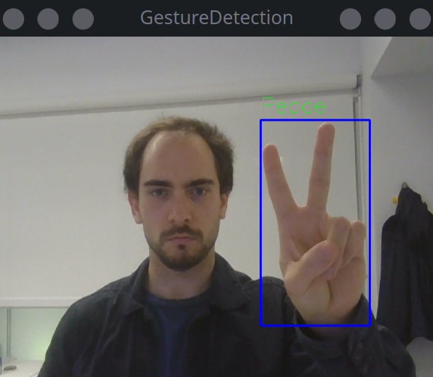

# Gesture Recognition
Bonsai example of running a YOLOv10n-based hand gesture recognition model for online inference of hand gestures.

## Overview
- `weights/` holds the pretrained `YOLOv10n_gestures.pt` checkpoint (from the [HaGRID repo](https://github.com/hukenovs/hagrid)) and the exported TorchScript model consumed by **Bonsai.ML.Torch**.
- `generate_torchscript_model.py` loads the raw checkpointed weights into a `YOLO` model using the `ultralytics` package, and then registers all custom Ultralytics/Torch modules required to serialize the model. It then exports the loaded model to TorchScript format and places it into the `weights/` folder.
- `GestureRecognition/` contains a Bonsai package with operators for decoding the models output and overlaying the labels/bounding boxes onto an image.
- `demo.bonsai` provides a minimal example workflow running online inference to detect hand gestures.

## Quick Start
1. **Python**
    - Ensure uv is installed or Python (v3.12).
	- Install dependencies with `uv sync` (uv is recommended) or `pip install -e .`.
	- Generate the TorchScript scripted model from the model checkpoint: `uv run generate_torchscript_model.py`.
2. **Bonsai package**
    - Ensure `dotnet` (v8) is installed.
	- Build and package the .NET library: `dotnet build -c Release && dotnet pack`.
	- (Preferred) Bootstrap the provided Bonsai environment with `dotnet new bonsaienvl` or run the `Bonsai` debug command in vs code.
	- (Alternative) Launch Bonsai's package manager and add the `GestureRecognition/bin/Release` folder to your NuGet sources with the name `GestureRecognition - Local`. Back in the package manager, select the `GestureRecognition - Local` source, and install the `GestureRecognition` package.

## General Usage
- Load the TorchScript model with the `LoadScriptModule` operator.
- Use the `Preprocess` node on the video stream to convert raw images into tensors.
- Pass the processed tensor to the `Forward` operator, making sure the model is loaded and set to the `Model` property.
- Convert the model's output into a `List<GestureDataFrame>` using the `GestureData` operator. 
- Visualize the results.

## Demo

